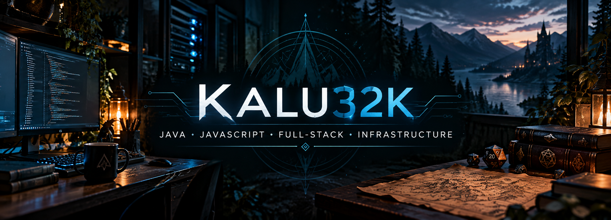

<!-- Profile README for Kalu32k -->

<!-- Profile README for Kalu32k -->

  

Java and JavaScript developer - full-stack and infrastructure enthusiast
Building DnD tools

  
  <!-- REPO_COUNT: -->
  
  
  

  
  
  

---

## About me

- Studying System Development (Java / JavaScript)
- Based in Sweden
- Interests: backend, full-stack, infrastructure, homelab (Proxmox)
- Currently building: DnD Manager (full-stack)

---

## Tech Stack

Java • Spring Boot • JavaScript • TypeScript • React • Next.js • Node.js • MySQL • Docker • Linux • Proxmox

  
  
  
  
  
  

---

## Featured Projects

- **DnD Manager** - Full-stack character/world manager - Next.js • React • MySQL • Docker
- **Spring Boot REST API** - Authentication, RBAC - Java • Spring Boot • MySQL
- **Wordle** - Full-stack game with highscores - React • Express • MongoDB

Explore repositories in my GitHub profile for demos and code.

---

<!-- End of profile README -->
<!-- End of profile README -->
